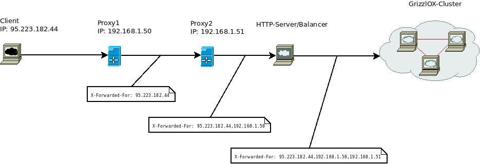

## Throttling
Throttling은 요청이 승인되어야하는지 여부를 결정한다는 점에서 사용 권한(permissions)과 유사합니다. Throttles은 임시 상태를 나타내며 클라이언트가 API에 대해 수행 할 수있는 **요청 비율을 제어**하는 ​​데 사용됩니다.

사용 권한과 마찬가지로 여러 throttles 사용할 수 있습니다. API에는 인증되지 않은 요청에 대한 제한적인 스로틀과 인증 된 요청에 대한 제한적인 스로틀이있을 수 있습니다.

### How throttling is determined
사용 권한 및 인증과 마찬가지로 REST 프레임 워크의 throttling은 항상 클래스 리스트로 정의됩니다.

뷰의 본문을 실행하기 전에 목록의 각 스로틀이 점검됩니다. 스로틀 확인이 실패하면 예외가 발생하고 제한된 예외가 발생하며보기 본문이 실행되지 않습니다.

### Setting the throttling policy

#### 1. 전역으로 설정하는 법
```python
REST_FRAMEWORK = {
    'DEFAULT_THROTTLE_CLASSES': (
        'rest_framework.throttling.AnonRateThrottle',
        'rest_framework.throttling.UserRateThrottle'
    ),
    'DEFAULT_THROTTLE_RATES': {
        'anon': '100/day',
        'user': '1000/day'
    }
}
```
#### 2. 각 view 또는 viewset에 설정하는 법
```python
from rest_framework.response import Response
from rest_framework.throttling import UserRateThrottle
from rest_framework.views import APIView

class ExampleView(APIView):
    throttle_classes = (UserRateThrottle,)

    def get(self, request, format=None):
        content = {
            'status': 'request was permitted'
        }
        return Response(content)
```

#### 3. function based view에 @api_view 데코레이터를 사용하는 법
```python
@api_view(['GET'])
@throttle_classes([UserRateThrottle])
def example_view(request, format=None):
    content = {
        'status': 'request was permitted'
    }
    return Response(content)
```

### How clients are identified


`X-Forwarded-For` 및 `Remote-Addr` HTTP 헤더는 스로틀 링을 위해 클라이언트 IP 주소를 고유하게 식별하는 데 사용됩니다. `X-Forwarded-For` 헤더가 있으면 사용되며, 그렇지 않으면 `Remote-Addr` 헤더의 값이 사용됩니다.

고유 한 클라이언트 IP 주소를 엄격하게 식별해야하는 경우 `NUM_PROXIES` 설정하여 API가 실행되는 응용 프로그램 프록시 수를 구성해야합니다. 이 설정은 0 이상의 정수 여야합니다. 0이 아닌 값으로 설정되면 클라이언트 IP는 응용 프로그램 프록시 IP 주소가 제외되면 `X-Forwarded-For` 헤더의 마지막 IP 주소로 식별됩니다. 0으로 설정하면 `Remote-Addr` 헤더가 항상 식별 IP 주소로 사용됩니다.

`NUM_PROXIES` 설정을 구성하면 고유 한 NAT 게이트웨이 뒤에있는 모든 클라이언트가 **단일 클라이언트로 처리**된다는 것을 이해하는 것이 중요합니다.

## API Reference
- AnonRateThrottle : 인증되지 않은 사용자만 차단합니다. 들어오는 요청의 IP 주소는 스로틀 할 고유 키를 생성하는 데 사용됩니다. 알 수없는 출처의 요청 비율을 제한하려는 경우에 적합합니다.
- UserRateThrottle : API를 통해 주어진 요청 비율로 사용자를 제한합니다. 사용자 ID는 스로틀 할 고유 키를 생성하는 데 사용됩니다. 인증되지 않은 요청은 들어오는 요청의 IP 주소를 사용하여 스로틀 할 고유 키를 생성합니다. 사용자별로 간단한 전역 속도 제한을 원할 때 적합합니다.
- ScopedRateThrottle : API의 특정 부분에 대한 액세스를 제한 할 수 있습니다. 
